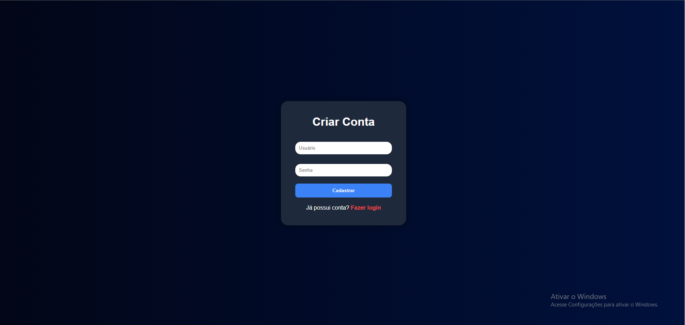
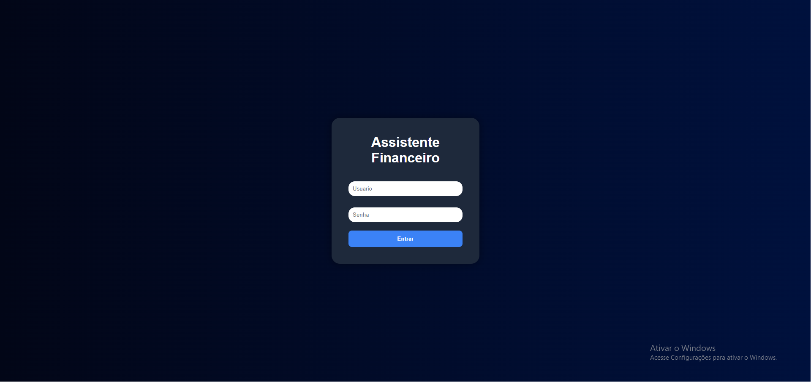
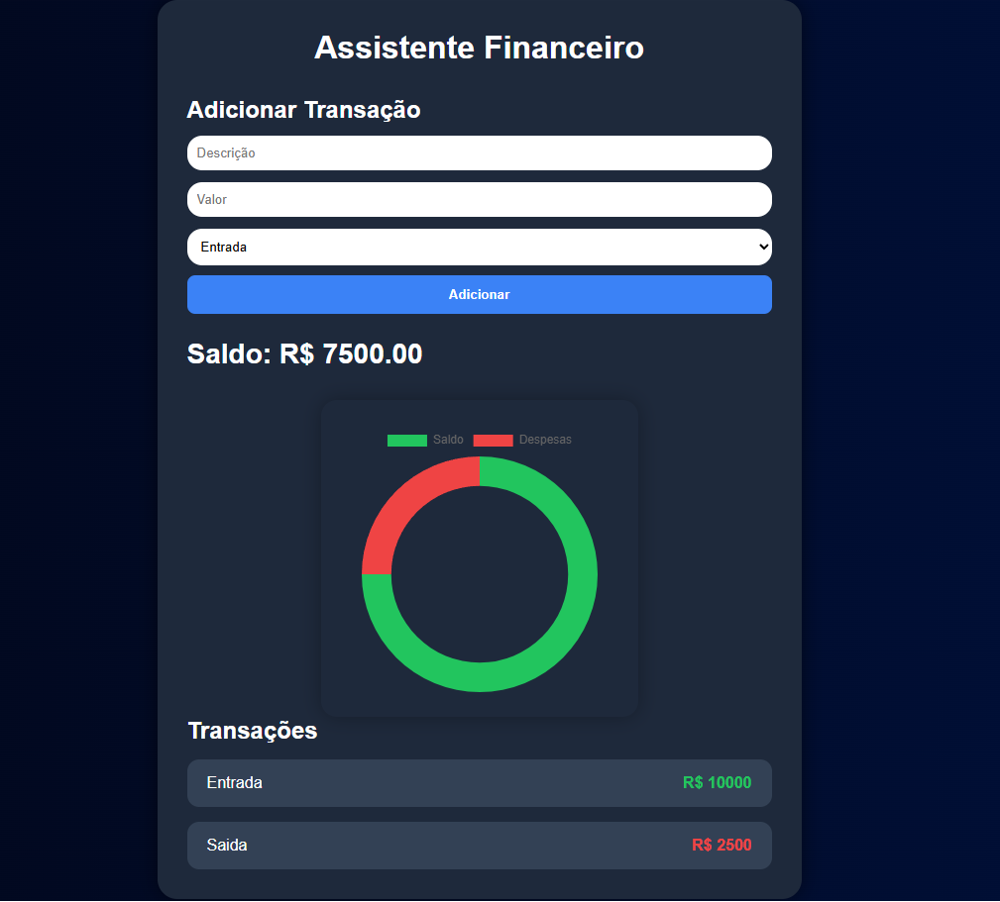

# sistema-financas
#  Sistema Financeiro Fullstack

Sistema financeiro desenvolvido com Java + Spring Boot, permitindo controle de receitas e despesas com autenticação de usuários.

---

## Funcionalidades

✅ Cadastro de usuários  
✅ Login de usuários  
✅ Controle de receitas e despesas  
✅ Dashboard financeiro  
✅ Saldo automático  
✅ Gráfico de despesas  
✅ Sistema multiusuário  
✅ Deploy online

---

##  Tecnologias utilizadas

### Backend
- Java
- Spring Boot
- Spring Data JPA
- H2 Database

### Frontend
- HTML
- CSS
- JavaScript
- Chart.js

### Ferramentas
- Git
- GitHub
- Render

---

##  Screenshots

### Tela de Cadastro



---

### Tela de Login



---

### Dashboard



---

## 🌐 Deploy

Projeto online:

https://sistema-financas-vvbk.onrender.com

---

##  Como rodar o projeto

```bash
git clone https://github.com/JoaoRicardo71/assistente-financeiro.git